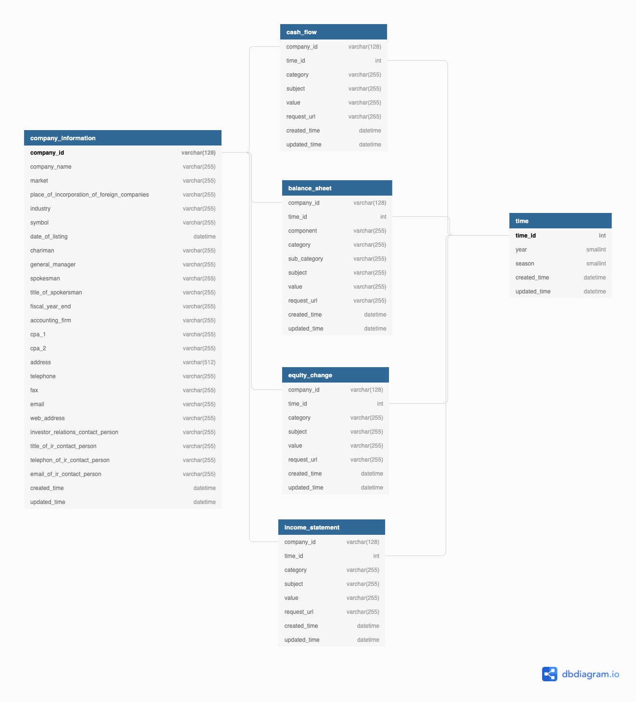

## Financial Crawler

For now, the crawler can crawl the following reports from [MOPS](https://emops.twse.com.tw/server-java/t58query).

 1. BalanceSheet
 2. CashFlow
 3. IncomeStatement
 4. EquityChange
   
   
### Database Schema
 - You can check the detail schema of this project on [db_schema.dbml](./db_schema.dbml)
  
 - The following plot is generated by [dbdiagram.io](https://dbdiagram.io/home), and how to write DBML can refer from [DBML](https://www.dbml.org/home/#benefits).

